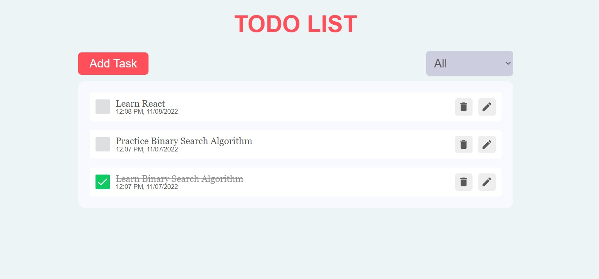

# task-keeper

A complete todo application with all features.

**[live demo](https://task-keeper-azure.vercel.app/)**

---

### Made with ❤️ by [Miraj Asraf](https://www.linkedin.com/in/miraj-asraf-2b3087189/)

## Project Description

In the project, I've created a Complete Todo Application with all features using `React.js` and to manage our states, I used `Redux`. Also to make simple animations used `Framer Motion`.

## Features
* Check box for done/undone.
* Unfinished task list view.
* Done task list view.
* Edit the task.
* Delete the task.
* Appears a pop-up after adding/deleting task.
* Sorted by time & date (most recent on the top).
* Status for complete/incomplete.
* Hitting the refresh button do not cause any change.
* Works like regular offline app.
* Easy to use interface.

## What I've used

- [React](https://reactjs.org/)
- [React Redux](https://redux.js.org/)
- [Framer Motion](https://framer.com/motion/)
- [React icons](https://react-icons.netlify.com/)
- [React Hot Toast](https://react-hot-toast.com/)

## Tools Used

1. Favicon: [Flaticon.com](https://www.flaticon.com/)
1. Code Editor: [VS Code](https://code.visualstudio.com/)
